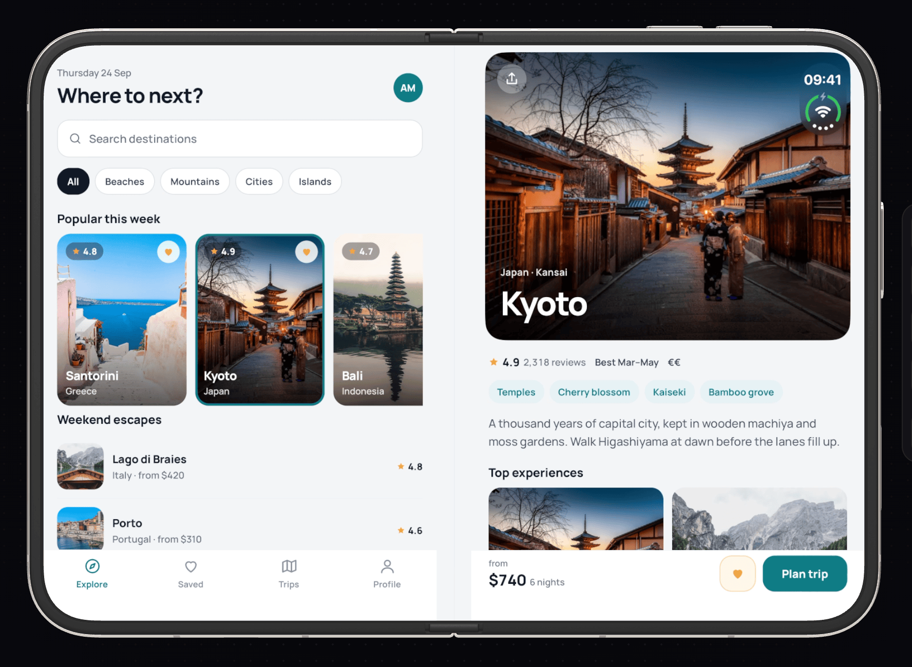
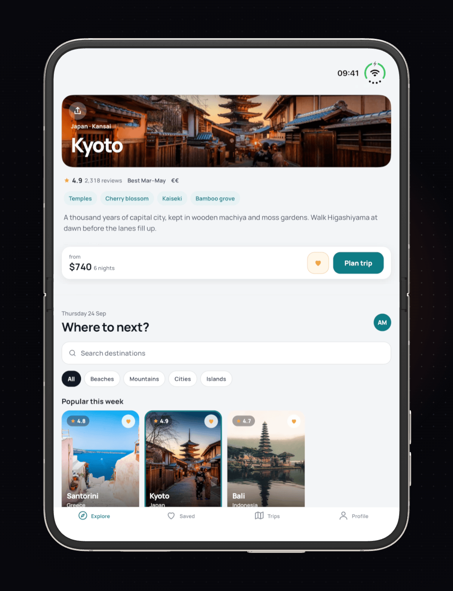
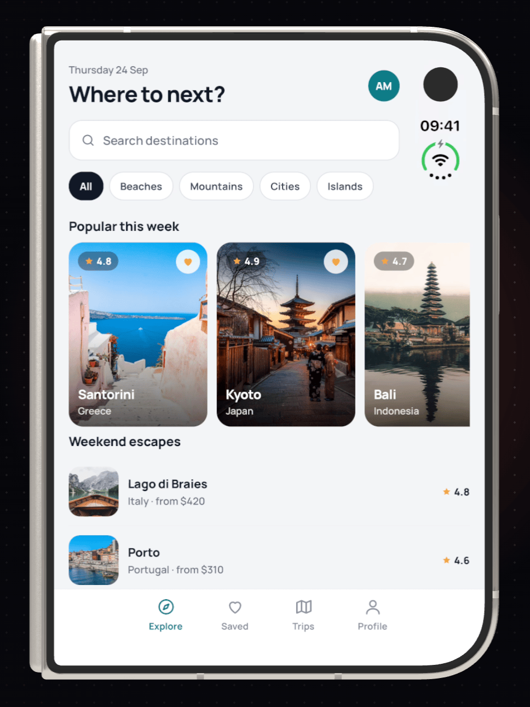

# Atlas

A small travel app: find a place, open it, save it.

No account, no server, no persistence: every session starts identical, with
the same six saved places, the same two trips and the same photos.

**This is a sample app.** It is the app on the device in the screenshots on
[vibeview.io](https://vibeview.io), and it shows a complete
[VibeView](https://vibeview.io) setup for an Expo project: cloud builds, live
development on cloud simulators and emulators, signing and store submission.
It is also a worked example of an adaptive React Native layout for iPhone Duo.
Copy the parts you need; do not expect much from the app itself.

React Native + Expo (SDK 58 preview), TypeScript, Expo Router. One codebase,
iOS and Android.

<p align="center">
  
</p>
<p align="center">
  
  
</p>

## The app

- **Explore**: search, category chips (Beaches, Mountains, Cities, Islands),
  a *Popular this week* rail of photo cards and a *Weekend escapes* list.
- **Destination**: a hero photo, rating, tags, a short description, *Top
  experiences*, and a booking bar with Save and Plan trip.
- **Saved**: collections and a two-column grid of saved places.
- **Trips**: the planned trips.
- **Profile**: stats, settings rows and Sign out.

State is kept in memory and seeded on launch. The seven destination photos
are bundled in the app, so it looks the same everywhere and never waits on
the network. The generated `ios/` and `android/` directories are not checked
in; `expo prebuild` recreates them for every build.

## iPhone Duo

Atlas adapts to iPhone Duo's two displays and its fold:

- **Closed (cover display)**: one pane, the phone app.
- **Open, or partly folded (inner display)**: two panes. The tabs sit on one
  side of the fold and the selected destination (Kyoto until you pick
  another) on the other. Nothing is drawn under the fold, and the split stays
  in the same place between partly folded and open flat, so the layout does
  not jump.
- **Open and rotated**: the fold runs across the display, so the panes stack:
  the destination above the fold, as a wide banner photo with a floating
  booking card, and the list below it.
- **Folding and unfolding keep your place**: the navigator is never
  remounted, so the tab, search text and scroll positions survive. A
  destination open on the cover display moves into the pane when you open
  the phone; the one you picked in the pane stays on screen when you close it.
- **Status bar corner**: iPhone Duo keeps the status bar in a block at the
  top trailing corner. Rows beside it make room for it, and the photo in the
  destination pane runs underneath.

### How it finds the fold

React Native and Expo have no fold API, so Atlas reads it from UIKit through
a small local Expo module, [`modules/atlas-fold`](modules/atlas-fold):

- `FoldObserverView` is an invisible, full-window native view. It asks UIKit
  for the window's reserved regions (`reservedRegionsOfKind:options:`, iOS
  27.1): the fold of a foldable display (a *division* region) and hardware
  that covers content, such as the cameras (an *occlusion* region). Each
  region comes with its frame and whether it is active (partly folded) or
  not (flat).
- It re-reads them whenever UIKit lays the view out (resizing, rotating,
  moving between the cover and inner displays), and on a short timer while
  it is on screen, because a fold can go from flat to partly folded without
  any size change. Only changes are sent to JavaScript, as an
  `onRegionsChange` event.
- The call lives in Objective-C behind `__has_include`, so the project still
  builds with older SDKs; there, and on older iOS versions, the module simply
  reports no regions.

[`src/layout/AdaptiveLayout.tsx`](src/layout/AdaptiveLayout.tsx) turns the
window size and those regions into a layout: a vertical fold splits the
window into side-by-side panes, a horizontal fold into stacked ones, and each
pane must be at least 300 points. Without a fold, a window of at least
700 × 500 points (an iPad, say) still gets two panes, split by width;
anything smaller gets the phone layout. On Android the module is absent and
the same size rule applies.
[`src/layout/AdaptiveShell.tsx`](src/layout/AdaptiveShell.tsx) places the
navigator and the destination pane without ever remounting the navigator.

The full inner display needs a build against the iOS 27.1 SDK (Xcode 27.1).
Built with an older SDK, Atlas runs on iPhone Duo in compatibility mode, in
a phone-sized window, and keeps the one-pane layout.

## Run it locally

Requirements: Node.js 22.13+ or 24.3+, and Xcode or Android Studio for a
local native build.

```bash
npm ci
npx expo start
```

Then press `i` for an iOS simulator or `a` for an Android emulator (this
needs a development build, e.g. `npx expo run:ios`). Other scripts:

```bash
npm run typecheck   # tsc --noEmit
npm run lint        # expo lint
```

Expo SDK 58 is a preview, and a few of its optional peer ranges do not list
React Native 0.88 yet, hence `legacy-peer-deps` in `.npmrc`.

## Run it on VibeView

With [VibeView](https://vibeview.io) you can build and run Atlas without a
local native toolchain: build it in the cloud, and the app streams from a
cloud simulator or emulator to your browser.

```bash
npm install -g vibeview     # or run any command below with npx vibeview
vibeview login
```

**Live development**: stream the app from a cloud device with Metro
hot-reload. The `metroCommand` in `vibeview.json` starts Metro for you.

```bash
vibeview dev                      # defaultPlatform (ios)
vibeview dev --platform android
vibeview dev --build              # rebuild and upload first
```

**Cloud builds**: compile a simulator / emulator build in the cloud and
register it as a build you can start a session on.

```bash
vibeview build --cloud --platform ios
vibeview build --cloud --platform android
vibeview build --cloud --platform all
```

Drop `--cloud` to build locally with the same commands from `vibeview.json`.

**iPhone Duo**: the session starts closed, on the cover display.

```bash
vibeview list-devices --models                    # find "iPhone Duo"
vibeview dev --detach --json --platform ios --model "iPhone Duo"
S=<session_id>
vibeview set-posture open --session $S            # or partial, closed
vibeview set-posture --angle 75 --session $S      # an exact hinge angle
vibeview rotate --session $S                      # a quarter turn
vibeview ui-tree --session $S                     # both panes, with their test ids
vibeview dev-stop                                 # sessions bill minutes while they run
```

**Production builds and store submission**: a signed release build needs a
signing credential uploaded to your VibeView organization first (see
[App signing](https://vibeview.io/docs/app-signing)).

```bash
vibeview build --cloud --production --platform ios
vibeview submit --platform ios
vibeview submit --platform android --track internal
```

### `vibeview.json`

| Key | What it does |
|---|---|
| `defaultPlatform` | Platform `vibeview build` / `vibeview dev` use when `--platform` is omitted. |
| `metroCommand`, `metroPort` | How `vibeview dev` starts Metro when nothing is listening on the port. |
| `platforms.<p>.build.command` / `.artifact` | The debug (simulator / emulator) build. Each command runs `npm ci` (a cloud build starts from a clean checkout), `expo prebuild` for the platform, then drives `xcodebuild` (simulator SDK, no code signing) or `gradlew assembleDebug` directly. `npx expo run:*` expects a booted simulator or a connected device to install onto, which a build machine does not have. |
| `platforms.<p>.build.productionCommand` / `.productionArtifact` | The signed release build used by `vibeview build --cloud --production`: `xcodebuild archive` + `-exportArchive` producing an `.ipa`, or `gradlew bundleRelease` producing an `.aab`. |
| `platforms.<p>.build.autoIncrement` | Each production build receives the next build number as `VIBEVIEW_BUILD_NUMBER`; `app.config.ts` maps it to `ios.buildNumber` and `android.versionCode`. |
| `platforms.android.submit.track` | The Google Play track `vibeview submit` uses. |

There is deliberately no `appId`: the first `vibeview build` writes it back
into `vibeview.json`, either linking to an app you pick or creating one from
the build.

Two small Expo config plugins in `plugins/` cover what a managed project has
no native files for:

- `with-bundled-debug.js` embeds the JavaScript bundle in debug builds too. A
  stock debug build expects Metro and shows a red "No script URL" screen
  without it; a share link or a test run on a cloud device has no Metro. It
  empties Gradle's `debuggableVariants` on Android and writes an
  `ios/.xcode.env.local` that makes the iOS bundle step produce a production
  bundle for Debug (a development bundle cannot run embedded). When Metro is
  running the app still prefers it, so the dev loop is unchanged.
- `with-vibeview-signing.js` appends a guarded `signingConfigs.release` block
  to the generated `android/app/build.gradle`, reading the four
  `VIBEVIEW_*` Gradle properties a production build provides. Without them
  the block is inert, so every other build is untouched.

No signing credentials are in the repository.

## Test ids

Every interactive element carries a stable `testID` and an
`accessibilityLabel`, so tests and agents can address it by name rather than
by coordinate. A React Native `testID` is the accessibility identifier on iOS
and the resource id on Android.

| Test id | Element |
| --- | --- |
| `tab-explore`, `tab-saved`, `tab-trips`, `tab-profile` | the four tab bar buttons |
| `search-input` | Explore search field (label `Search destinations`) |
| `chip-all`, `chip-beaches`, `chip-mountains`, `chip-cities`, `chip-islands` | Explore category filters |
| `destination-card-<id>` | a photo card, e.g. `destination-card-santorini` |
| `card-save-<id>` | the heart on a photo card |
| `destination-row-<id>` | a Weekend escapes row |
| `explore-title`, `explore-scroll`, `weekend-list`, `explore-no-results` | Explore landmarks |
| `destination-name`, `destination-rating`, `destination-price` | Destination text |
| `back-button`, `share-button` | Destination hero buttons (the pane has no Back) |
| `detail-pane-scroll`, `pane-divider` | two-pane layout: the destination pane and the gap at the fold |
| `save-button` | Destination Save toggle (label `Save` / `Saved`) |
| `plan-trip-button` | Destination Plan trip button |
| `experience-<title>` | a Top experiences tile |
| `saved-title`, `saved-subtitle`, `saved-grid`, `saved-empty`, `saved-collection-empty` | Saved landmarks |
| `collection-all`, `collection-summer-2027`, `collection-someday` | Saved collection chips |
| `trips-title`, `trips-list`, `trips-empty`, `trip-<id>` | Trips landmarks |
| `profile-name`, `profile-stats`, `stat-countries`, `stat-trips`, `stat-saved` | Profile landmarks |
| `setting-trip-preferences`, `setting-notifications`, `setting-currency`, `setting-units`, `setting-help` | Profile settings rows |
| `sign-out-button` | Profile Sign out |

Destination ids are `santorini`, `kyoto`, `bali`, `lago-di-braies`, `porto`,
`zermatt` and `tulum`.

## Project structure

```
app/                        Expo Router routes
  _layout.tsx               fonts, splash, providers, adaptive shell, stack
  (tabs)/_layout.tsx        the four tabs
  (tabs)/index.tsx          Explore: search, categories, rail, list
  (tabs)/saved.tsx          Saved: collections and a 2-column grid
  (tabs)/trips.tsx          Trips: planned trips
  (tabs)/profile.tsx        Profile: stats, settings, sign out
  destination/[id].tsx      Destination (one-pane layout)
src/
  components/               DestinationCard, DestinationRow, DestinationDetail,
                            Screen, Chip, Avatar, EmptyState, icons
  layout/                   one pane or two: fold-aware layout, shell,
                            opening destinations
  data/destinations.ts      the seven destinations
  state/AppState.tsx        saved places and trips (in memory, seeded)
  theme/theme.ts            colours, fonts, radii
modules/atlas-fold/         native view reporting the fold and cameras (iOS)
plugins/                    Expo config plugins for cloud builds and signing
assets/photos/              the seven bundled photos
docs/screenshots/           the images in this README
app.config.ts               app name, ids, icon, splash, build number
vibeview.json               VibeView build and dev configuration
```

## Photo credits

The seven photos in `assets/photos/` are from [Unsplash](https://unsplash.com)
and used under the [Unsplash License](https://unsplash.com/license), resized
to 720 pixels wide.

| File | Used for | Source |
| --- | --- | --- |
| `santorini.jpg` | Santorini, Greece | [photo-1533105079780-92b9be482077](https://images.unsplash.com/photo-1533105079780-92b9be482077) |
| `kyoto.jpg` | Kyoto, Japan | [photo-1493976040374-85c8e12f0c0e](https://images.unsplash.com/photo-1493976040374-85c8e12f0c0e) |
| `bali.jpg` | Bali, Indonesia | [photo-1537996194471-e657df975ab4](https://images.unsplash.com/photo-1537996194471-e657df975ab4) |
| `dolomites.jpg` | Lago di Braies, Italy | [photo-1476514525535-07fb3b4ae5f1](https://images.unsplash.com/photo-1476514525535-07fb3b4ae5f1) |
| `porto.jpg` | Porto, Portugal | [photo-1555881400-74d7acaacd8b](https://images.unsplash.com/photo-1555881400-74d7acaacd8b) |
| `lake.jpg` | Zermatt, Switzerland | [photo-1506905925346-21bda4d32df4](https://images.unsplash.com/photo-1506905925346-21bda4d32df4) |
| `beach.jpg` | Tulum, Mexico | [photo-1507525428034-b723cf961d3e](https://images.unsplash.com/photo-1507525428034-b723cf961d3e) |

## License

MIT. See [LICENSE](LICENSE).
